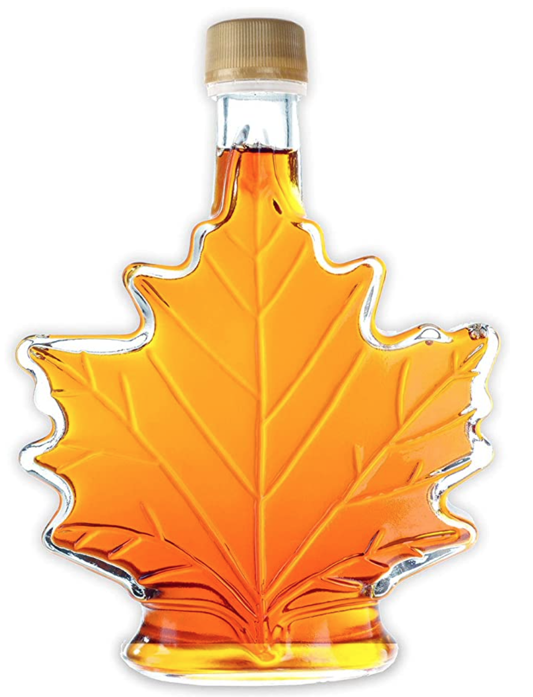

# Capteurs [IOT](https://en.wikipedia.org/wiki/Internet_of_things) 
[Historique](#historique) |  [Niveau de liquide](#capteur-de-distance-par-ultrason) |  [Vibration](#capteur-de-vibration) | [Sonore](#capteur-sonore) | [Fuite vacuum](#d%C3%A9tecteur-de-fuite-de-vacuum) | [Module d'affichage](#module-daffichage) | [Répéteurs](#r%C3%A9p%C3%A9teur-r%C3%A9seau-sans-fil-pour-capteur) | [Réseau cellulaire](#r%C3%A9seau-cellulaire) | [Prix et produits](#prix-et-produits)

## Historique
A l'automne 2021 je rends visite à un ami qui possède une érablière d'environ 1500 entailles.  En visitant son érablière, nous discutons du processus de production du sirop d'érable ainsi que des différentes problématiques que cela impose. Le processus est complexe et le maitriser est plus un art qu'une technique.  Je constate cependant quelques points sur lesquels je peux peut-être l'aider.

Durant la période des sucres, il doit fréquemment se rendre à son érablière qui est à plus de 30 minutes de sa maison pour voir le niveau de ses réservoirs d'eau d'érable pour estimer quel est le meilleur moment pour démarrer la production.  S'il n'y a pas suffisamment d'eau dans les réservoirs, cela ne vaut pas la peine de démarrer la production, car cela ne sera pas rentable.  Il fait régulièrement ce trajet et revient la plupart du temps bredouille sans avoir fait de la production et avec le stress de revenir trop tard et de perdre le précieux liquide transparent.

Je lui propose alors de tenter de trouver une solution à son problème. Son érablière ayant internet, je peux lui développer un capteur de niveau de liquide qui utilisera internet pour l'avertir lorsque le bon niveau sera atteint.

Quelques semaines plus tard, je retourne à son érablière et nous réalisons la première installation de deux capteurs ultrasonique relié à un moniteur ayant la capacité de communiquer par wifi et de transmettre des alarmes lors les niveaux de liquides sont atteints.  L'installation nous prend environ une journée puisque je dois faire des adaptations de dernières minutes pour traiter le bruit dans la réception des signaux des capteurs ultrasonique principalement causé par la forme des cuves d'acier inoxydable.

Nous attendons la production de l'hiver 2022 pour confirmer le bon fonctionnement des capteurs.  A priori tout semble indiquer que les capteurs remplissent adéquatement leur rôle. 

En discutant avec d'autres producteurs acéricoles, je constate que c'est un problème généralisé et que je peux y apporter une solution.  Ayant [plusieurs années d'expérience](https://www.linkedin.com/in/yvanross/) en développement logiciel, en électronique, en mécanique je décide d'y apporter une solution un peu plus industrielle. 

Pour ce faire je dois tenir compte de plusieurs facteurs:
- certains sites de production n'ont pas d'électricité en permanence;
- la majorité des sites n'ont pas d'accès à internet;
- l'installation doit se faire plus rapidement;

Donc, les capteurs doivent pouvoir fonctionner:
- sans connexion réseau filaire;
- en communiquant entre eu sans réseau internet;
- avec une batterie ou avec électricité;
- et être connecté à un module permettant la connexion avec un réseau cellulaire;
 
## Configurations possibles

Vous pouvez configurer nos capteurs pour qu'il fonctionnent avec votre réseau Wifi ou sur leur propre réseau que l'on peut connecter aux réseau cellulaire pour vous envoyer les alarmes par courriels ou SMS.
## Capteur de distance par ultrason
Je vous présente donc le [capteur de distance par ultrason](products/ESP8266-us-100-README_fr.md) développé dans le cadre de ce projet.  Les prototypes de cette nouvelle version seront en test en mars 2022.
[Je suis intéressé](contact_form.md)

## Réseau cellulaire
J'attends de recevoir le module GSM pour connecter les capteurs aux réseaux cellulaires ce qui me permettra de répondre à la demande des entreprises n'ayant pas de réseau internet. Les premiers essais seront à réaliser d'ici la fin février 2021.  
[Je suis intéressé](contact_form.md)

## Module d'affichage
Recevoir une notification par courriel ou SMS est intéressante mais quand vous êtes sur place vous aimeriez probablement consulter en temps réel l'état de vous différents capteurs et recevoir une notification visuelle ou sonore lorsqu'une alarme est générée.  Je vous propose donc un module d'affichage qui pourra remplir adéquatement cette tâche.
[Je suis intéressé](contact_form.md)

## Capteur de vibration
En continuant de discuter avec mon ami, il m'indique qu'il aimerait bien savoir quand sa pompe de vacuum fonctionne, cela lui donne un indice de la vitesse à laquelle ses bassins vont se remplir.  Un capteur de vibration permettant de détecter si un moteur fonctionne est en cours de développement et devrait être en test en mars 2022.
[Je suis intéressé](contact_form.md)

## Capteur sonore
Dans le cadre de notre R&D, nous avons développé un capteur sonore pour détecter le fonctionnement de la pompe à vacuum.  Nous allons probablement remplacer celui-ci par le capteur de vibration qui répondra probablement encore mieux au problème. 
[Je suis intéressé](contact_form.md)

## Détecteur de fuite de vacuum
Parallèlement à toutes ces discussions, un autre problème d'importance affecte les acériculteurs et celui-ci concerne la perte de vacuum dans les lignes pour la récolte de l'eau d'érable.  Les fuites sont difficiles à trouver et il est pénible d'accéder à celle-ci pour en faire la réparation. L'effort physique et monétaire pour résoudre ce problème est important. Toute sorte de techniques ont été utilisées. Plus ou moins efficaces, dispendieuse, il n'y a pas de solutions idéales.     

Je décide donc de regarder ce que je peux y faire. Je suis encore en mode R&D et j'ai quelques pistes de solution que je compte mettre à l'épreuve en mars 2022.  Je suis en train d'assembler les premiers prototypes et si tout fonctionne bien je prévois faire un essai grandeur nature avec une cinquantaine de capteurs à l'hiver 2023. 
[Je suis intéressé](contact_form.md)

## Répéteur réseau sans fil pour capteur
Le dernier problème à résoudre concerne la distance entre les capteurs et le routeur Wifi ou le module GSM.  Les capteurs ont une capacité de communication sans fil de plus de 250 mètres.  Alors il sera parfois nécessaire d'utiliser des répéteurs. Ceux-ci sont en cours de développement. La solution logiciel est en cours de développement et sera testée après le mois de mars 2021.
[Je suis intéressé](contact_form.md)

## Intérêt envers un produit ou une solution
Vous aimeriez faire une précommande ou avez des questions sur un de ses produits, n'hésitez pas à nous contacter.
[Je suis intéressé](contact_form.md)

Vous seriez [disposé à installer des capteurs](contact_form.md) à votre installation pour que nous puissions compléter notre R&D.

## Fabrication des capteurs
Nous fabriquons nous-mêmes nos capteurs pour répondre aux besoins spécifiques de chaque client. Vous avez besoin d'une fonctionnalité spécifique, d'un détecteur spécifique, nous pourrions possiblement le réaliser. Le coût le plus élevé provient de l'environnement logiciel qu'il faut développer pour les nouveaux capteurs.  Nous travaillons à développer notre logiciel pour qu'il réponde aux besoins de toute une famille de capteur. Il est fort probable que la fonctionnalité recherchée existe déjà dans notre plateforme.   

## Délai de fabrication
Nous tentons de trouver les pièces électroniques les moins dispendieuses possibles tout en ayant une bonne qualité de produit, ce qui résulte en un délai d'approvisionnement qui peut prendre quelques mois. 

## Prix et produits
 N'hésitez pas à nous contacter si vous désirez des informations sur les [prix et produits](contact_form.md)

[Discuter avec les membres de notre communauté](https://github.com/yvanross/iot-sensor-doc/discussions)

 
Yvan Ross Ing.
yvan.ross+sales@gmail.com
514-797-8894
Richelieu, Québec
[Linked-in](https://www.linkedin.com/in/yvanross/) 

