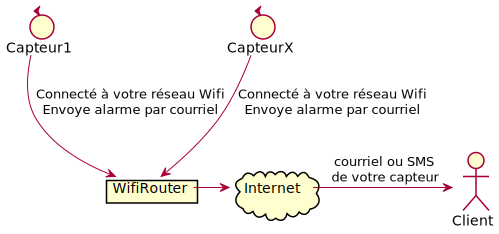
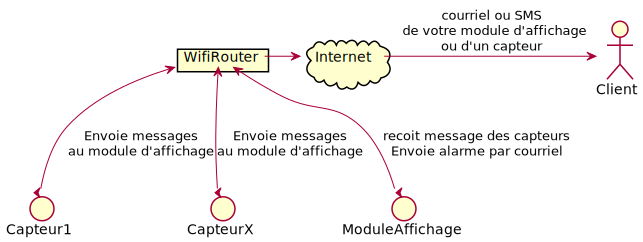
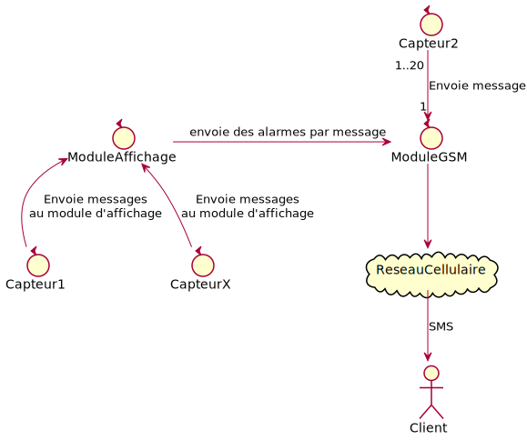
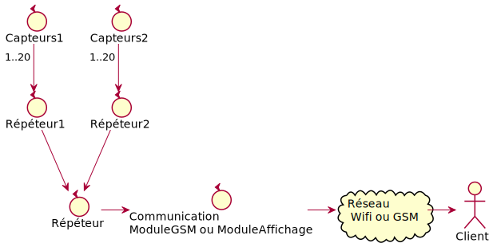

#### [Page pricipale](../README.md)
#  Guide d'usager
- Capteur: L110-UD-TC-001
- Capteur: L220-UD-TC-001

Ce document fournit les spécification et explique comment installer, configurer et utiliser le capteur de distance par ultrason. 

## Spécification:
- Distance détecté: 2cm – 450 cm/0.79po - 177po
- Précision: 0.3cm +1% / 1/8po +1%
- Température d'opération: -20~ + 70º
- Angle de mesure: moins de 15 degrés
- Puissance de transmission:
  - 802.11b: 16+/- 2 dBm (@11Mbps)
  - 802.11g: 14+/-2 dBm (@54Mbps)
  - 802.11n: 13+/-2 dBm (@HT20, MCS7)
- Range de fréquence:   2412 ~ 2484 MHz
- Certification du processeur: FCC, CE, IC, REACH, RoHs
- Fréquence de mesure: 
  - Minimum: 1 seconces
  - Maximum: Aucune 
- Alimentation: 
  - Power supply 110vac à 3 vdc
  - Power supply 220vac à 3 vdc
- Distance entre le capteur et le router ou le répéteur:
  - Variable selon l'environnement ~ 250 mètres / 820 pieds

## Installer
Le capteur fonctionne avec un voltage de 3 volt DC. Le transformateur fournie avec celui-ci permet d'alimenter le capteur adéquatement.  La distance entre le capteur et l'alimentation électrique peut aller à plus de 100 pieds de distance.  Vérifier la liste de nos produits pour vous procurer la bonne longueur de d'extension d'alimentation.

## Configurer
 Il existe plusieurs configurations pour utiliser ce capteur de distance.

### Avec un réseau Wifi
#### En mode Autonome 

Nombre de capteur limité par le réseau. [Envoyer un SMS à votre cellulaire](#convertir-un-courriel-en-sms).

#### Avec un module d'affichage

Nombre de capteur limité par le réseau. Envoyer un SMS à votre cellulaire](#convertir-un-courriel-en-sms).

### Sans réseau Wifi
#### Avec module GSM

Nombre de capteur limité à 20

#### Avec répéteurs

Chaque répéteur permet d'ajouter 20 capteurs à votre réseau. Les répéteurs n'utilisent votre réseau Wifi.

## Convertir un courriel en SMS
La plupart des fournisseurs de services internet offre gratuitement un mécanisme pour envoyer un message à votre téléphone cellulaire à partir d'une adresse de courriel.

Voici quelques exemples:

  - Rogers Wireless: [10-digit phone number]@pcs.rogers.com
  - Fido: [10-digit phone number]@fido.ca
  - Telus: [10-digit phone number]@msg.telus.com
  - Bell Mobility: [10-digit phone number]@txt.bell.ca
  - Kudo Mobile: [10-digit phone number]@msg.koodomobile.com
  - MTS: [10-digit phone number]@text.mtsmobility.com
  - President’s Choice: [10-digit phone number]@txt.bell.ca
  - Sasktel: [10-digit phone number]@sms.sasktel.com
  - Solo: [10-digit phone number]@txt.bell.ca
  - Virgin: [10-digit phone number]@vmobile.ca
      
Vérifier avec votre fournisseur avant de commander votre capteur.

# Clignottement LED bleu
  1: 1000ms Connecté au réseau wifi: 1 fois par secondes
  2: 200ms Access point
  6: 10ms OTA
